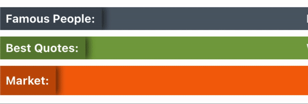

# ti.scroller

## Description
A simple library to create a marquee-like elements in your Appcelerator Titanium Apps for both Classic and Alloy projects.

- You can create multiple scrollers and customize them separately
- Each scroller can display one or multiple messages, cicle between them or display them in random order
- You can update its content at any time ( messages, color, position, delay, etc. )
- Works with Android & iOS

## Customization
You can customize the text color, background color, vertical position, font size, font weight, font family, scrolling speed, delay between messages, random order, and side label with the following `properties`:

- `color`
- `label`
- `delay`
- `speed`
- `height`
- `random`
- `top`/`bottom`
- `backgroundColor`
- `message`/`messages`
- `font` object with `fontSize`, `fontWeight`, `fontFamily`

## Basic usage
```javascript
let Scroller = require('ti.scroller')

let win = Ti.UI.createWindow({
    title: 'ti.scroller',
    backgroundColor: '#fff'
});

let messageScroller = new Scroller({
    message: 'Appcelerator Titanium: Everything you need to create great, native mobile apps — All from a single JavaScript code base.'
});

win.add(messageScroller.getView());

win.open();

messageScroller.animate();
```

## Result


***\* low framerate gif***

## Advanzed usage
```javascript
let Scroller = require('ti.scroller')

let win = Ti.UI.createWindow({
    title: 'ti.scroller',
    backgroundColor: '#fff'
});

let navWindow = Ti.UI.createNavigationWindow({
    window: win
});

let container = Ti.UI.createView({
    layout: 'vertical',
    height: Ti.UI.SIZE
});

let famousPeopleQuotes = new Scroller({
    top: 8,
    speed: 7,
    random: true,
    color: '#dddfe1',
    label: 'Famous People:',
    backgroundColor: '#53606b',
    messages: [
        "The greatest glory in living lies not in never falling, but in rising every time we fall. - Nelson Mandela",
        "The way to get started is to quit talking and begin doing. - Walt Disney",
        "Your time is limited, so don't waste it living someone else's life. Don't be trapped by dogma – which is living with the results of other people's thinking. - Steve Jobs",
        "If life were predictable it would cease to be life, and be without flavor. - Eleanor Roosevelt",
        "If you look at what you have in life, you'll always have more. If you look at what you don't have in life, you'll never have enough. - Oprah Winfrey",
        "If you set your goals ridiculously high and it's a failure, you will fail above everyone else's success. - James Cameron",
        "Life is what happens when you're busy making other plans. - John Lennon"
    ]
});

let bestQuotesOfAllTimes = new Scroller({
    top: 8,
    speed: 6,
    label: 'Best Quotes:',
    backgroundColor: '#79a342',
    messages: [
        "Whoever is happy will make others happy too. - Anne Frank",
        "It is during our darkest moments that we must focus to see the light. - Aristotle",
        "Always remember that you are absolutely unique. Just like everyone else. - Margaret Mead",
        "Spread love everywhere you go. Let no one ever come to you without leaving happier. - Mother Teresa",
        "When you reach the end of your rope, tie a knot in it and hang on. - Franklin D. Roosevelt",
        "Don't judge each day by the harvest you reap but by the seeds that you plant. - Robert Louis Stevenson",
        "The future belongs to those who believe in the beauty of their dreams. - Eleanor Roosevelt",
        "Tell me and I forget. Teach me and I remember. Involve me and I learn. - Benjamin Franklin",
        "The best and most beautiful things in the world cannot be seen or even touched — they must be felt with the heart. - Helen Keller",
        "Do not go where the path may lead, go instead where there is no path and leave a trail. - Ralph Waldo Emerson"
    ]
});

let marketStocks = new Scroller({
    top: 8,
    speed: 8,
    height: 36,
    label: 'Market:',
    backgroundColor: '#F3650C',
    messages: "EUR/USD 1.18664 0 0% · USD/JPY 110.399 0.06 0.05% · GBP/USD 1.38902 0 0% · EUR/JPY 130.9959 0.109 0.08% · GBP/JPY 153.3323 0.116 0.08% · USD/CAD 1.24481 -0.001 -0.08% · XAU/USD 1806.7484 -0.684 -0.04% · AUD/USD 0.74878 0.001 0.13% · USD/CHF 0.91462 -0.001 -0.11% · NZD/USD 0.69921 0.001 0.14%"
});

container.add(famousPeopleQuotes.getView());
container.add(bestQuotesOfAllTimes.getView());
container.add(marketStocks.getView());

Ti.App.addEventListener('paused', function() {
    marketStocks.pause();
    famousPeopleQuotes.pause();
    bestQuotesOfAllTimes.pause();
});

Ti.App.addEventListener('resume', function() {
    marketStocks.resume();
    famousPeopleQuotes.resume();
    bestQuotesOfAllTimes.resume();
});

win.add(container);

navWindow.open();

marketStocks.animate();
famousPeopleQuotes.animate();
bestQuotesOfAllTimes.animate();
```

## Result


***\* low framerate gif***

## Alloy Projects
For Alloy projects drop `ti.scroller` in `/app/lib/ti.scroller.js`.

```bash
app
└─ lib
   └─ ti.scroller.js
```

In your `xml` file, create a `View` element set the `module` attribute to `module="ti.scroller"`.

You can set any of the supported attributes directly in the `View`.

**IMPORTANT: For multiple `messages` you'll need to separate them with the `|` symbol like shown below.**

```xml
<Alloy>
    <NavigationWindow>
        <Window title="ti.scroller">
            <View module='ti.scroller' backgroundColor="#c91326" label="Famous Quotes:" speed="4" delay="2" height="32" random="true" top="0" font.fontFamily="Gill Sans" font.fontWeight="semibold" font.fontSize="16" message="Whoever is happy will make others happy too. - Anne Frank|It is during our darkest moments that we must focus to see the light. - Aristotle|Always remember that you are absolutely unique. Just like everyone else. - Margaret Mead" />
        </Window>
    </NavigationWindow>
</Alloy>
```

## Result


***\* low framerate gif***

In your `controller` you can call any of the available methods: `update`, `udpateLabel`, `updateMessages`, `updateBackground`, `pause` or `resume` at anytime.

```javascript
$.mainScroller.update({
    delay: 3,
    top: 48,
    label: 'Appcelerator:',
    message: 'Build great mobile experiences faster - Native apps. Mobile APIs. Real-time analytics. One Platform'
});
```

## Recomendation
To prevent unexpected behaviors, it is recommended to add the `paused` event in order to pause the scrolling effect while the app is in the background and the `resume` event to resume scrolling when in the foreground.

```javascript
Ti.App.addEventListener('paused', function() {
    scrollingText.pause();
    // For Alloy Projects
    $.scrollingText.pause();
});

Ti.App.addEventListener('resume', function() {
    scrollingText.resume();
    // For Alloy Projects
    $.scrollingText.resume();
});
```

## Properties glossary

### message/messages : `array`
The text to display can be set with `message` or `messages` property using an array ( for a single message you can set it using a string ).

```javascript
let messageScroller = new Scroller({
    messages: [
        'Every moment is a fresh beginning. – T.S Eliot',
        'Change the world by being yourself. – Amy Poehler',
        'Love For All, Hatred For None. – Khalifatul Masih III'
    ],
    ...
});
```

### label : `string`
To display a left-side label set the `label` property.

**Defaults to: `null`**

```javascript
let messageScroller = new Scroller({
    label: 'Braking News:',
    ...
});
```

### color : `string`
Color for the text message(s) and side label in `hex` value.

**Defaults to: `#fff`**

```javascript
let messageScroller = new Scroller({
    color: '#79a342',
    ...
});
```

### backgroundColor : `string`
Background color for the scroller, as a hex triplet.

**Defaults to: `#BF000000`**

```javascript
let messageScroller = new Scroller({
    backgroundColor: '#53606b',
    ...
});
```

### height : `number/string`
Scroller height, in platform-specific units.

**Defaults to: `28dp`**

```javascript
let messageScroller = new Scroller({
    height: 44
    ...
});
```

## Font Object
Set a `font` object to set the following properties:

### fontFamily: `string`
Specifies the font family or specific font to use.

**Defaults: Uses the default system font**

### fontSize: `Number/String`
Font size, in platform-dependent units.

**Defaults: `14dp`**

### fontWeight: `string`
Font weight. Valid values are "bold", "semibold", "normal", "thin", "light" and "ultralight".

The "semibold", "thin", "light" and "ultralight" weights are recognized on iOS only. "thin", "light" and "ultralight" are only available on iOS 8.2 and later.

**Defaults: `normal`**

```javascript
let messageScroller = new Scroller({
    font: {
        fontSize: 16,
        fontWeight: 'bold',
        fontFamily: 'Gill Sans'
    }
    ...
});
```

### top/bottom : `number/string`
The scroller's top OR bottom position. This position is relative to the scroller's parent.

You can use `px`, `%` or `dp` values.

**Defaults to: `undefined`**

```javascript
let messageScroller = new Scroller({
    top: 44,
    // OR
    bottom: 0
    ...
});
```

## Behavior properties

### delay : `number`
Pause the animation between messages in seconds.

**Defaults to: `0`**

```javascript
let messageScroller = new Scroller({
    delay: 3,
    ...
});
```

### speed : `number`
The speed of the scrolling text, a constant speed no matter the text length, the higher the number the faster the scrolling speed.

**Defaults to: `5`**

```javascript
let messageScroller = new Scroller({
    speed: 7,
    ...
});
```

### random : `boolean`
To display the messages in random order set `random` to `true`.

**Defaults to: `false`**

```javascript
let messageScroller = new Scroller({
    random: true,
    ...
});
```

## Update Methods
There are 4 `methods` to update the content and properties at any time.

- `update`
- `updateLabel`
- `updateMessages`
- `updateBackground`

### update
Is a general purpose method to change any or all of the following properties:

- color
- label
- delay
- height
- random
- top/bottom
- backgroundColor
- message/messages
- fontFamily, FontSize, fontWeight

When updating the message ( or messages ), the text will be shown after completing the currently running message.

```javascript
messageScroller.update({
    top: 0,
    delay: 0,
    label: 'Appcelerator:',
    message: 'Build great mobile experiences faster - Native apps. Mobile APIs. Real-time analytics. One Platform',
    font: {
        fontWeight: 'bold'
    }
});
```

### updateLabel
This method will instantly update the `label` property.

If the scroller does not originally contained a `label`, it will add it automatically.

```javascript
messageScroller.updateLabel('Braking News:');
```

### updateMessages
If you only need to update the message or messages, you can use the `updateMessages` method.

The updated text will be shown after completing the currently running message.

```javascript
messageScroller.updateMessages('Build great mobile experiences faster - Native apps. Mobile APIs. Real-time analytics. One Platform');

messageScroller.updateMessages( [
    'Build: Write in JavaScript, run native on any device and OS',
    'Connect: Get mobile-optimized access to any data source',
    'Measure: See usage & adoption, detect crashes, tune performance'
]);
```

### updateBackground
Use it to change the scroller's background color, including the `label` property if available.

```javascript
messageScroller.updateBackground('#79a342');
```

## License
<pre>
Copyright 2020-2021 César Estrada

Licensed under the Apache License, Version 2.0 (the “License”); you may not use this file except in compliance with the License.

You may obtain a copy of the License at

   http://www.apache.org/licenses/LICENSE-2.0

Unless required by applicable law or agreed to in writing, software distributed under the License is distributed on an “AS IS” BASIS, WITHOUT WARRANTIES OR CONDITIONS OF ANY KIND, either express or implied.

See the License for the specific language governing permissions and limitations under the License.
</pre>
